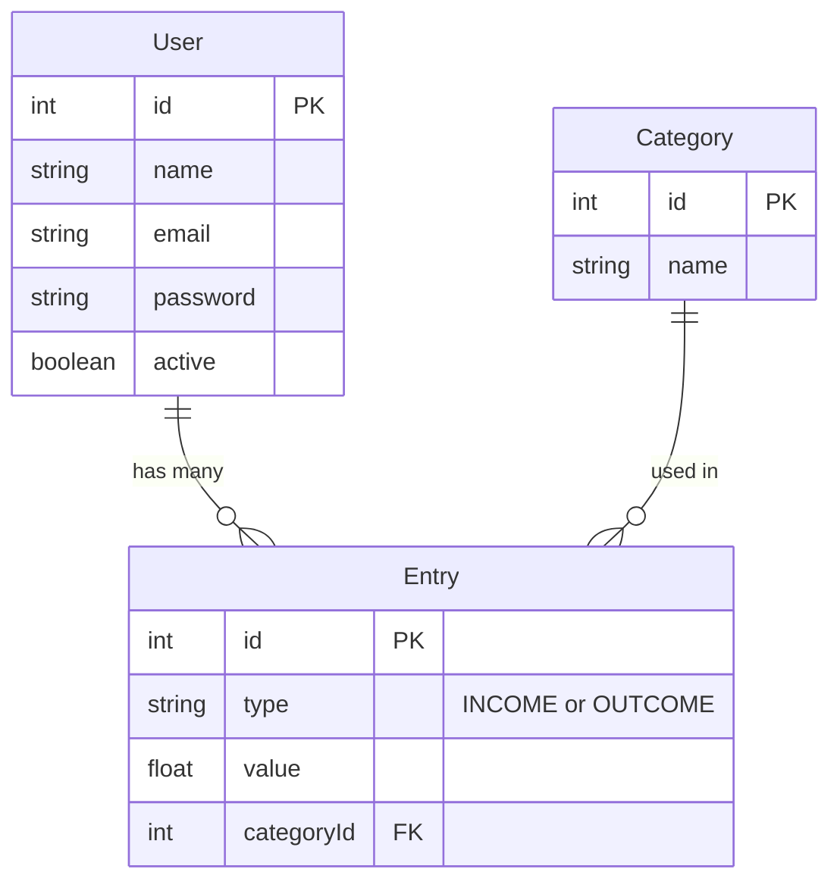

# Milagro: A Financial app to become millionaire

This project is a tool designed to help users manage their finances by tracking expenses, income, budgets, and savings goals.

### **Project Overview:**

The App will allow users to:

- Track income and expenses by categories (e.g., food, rent, entertainment).
- Set monthly budgets and get alerts when they are close to exceeding them.
- Visualize spending trends over time using charts and reports.
- Manage savings goals (e.g., saving for a vacation or a new car).
- Generate financial reports (e.g., monthly summaries, top expense categories).

